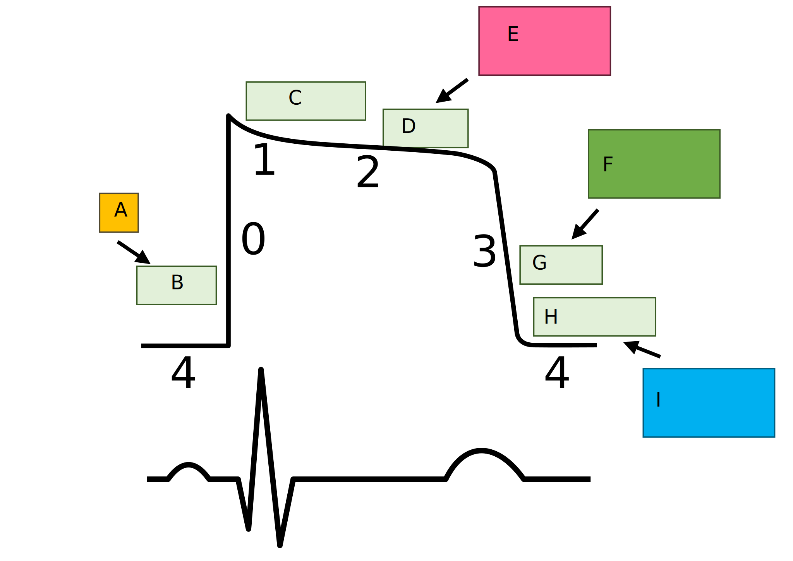

{}

## Basic Review

1. Inotropy
   - Positive
      - milrinone
      - dobutamine
      - epinephrine
      - digoxin
      - calcium  
   - Negative
      - beta-blockers
      - calcium channel blockers
2. Chronotropy
    - Positive
      - dopamine
      - dobutamine
      - epinephrine
      - atropine
    - Negative
      - amiodarone
      - beta blockers
      - non-dihydropyridine calcium channel blockers
      - digoxin
3. Dromotropy
    - Positive
      - isoproterenol
    - Negative
      - Amiodarone
      - Beta-blocker
      - Calcium channel blockers
      - Digoxin
      - Adenosine
4. Lusitropy
    - Positive
      - milrinone
      - dobutamine
      - nitroglycerine
      - nitroprusside
    - Negative
      - beta blockers
4. Bathomotropy
    - Positive
      - norepinephrine
      - epinephrine
      - digoxin
      - dopamine
      - dobutamine
    - Negative
      - beta-blockers
      - amiodarone

Fill in the blanks before looking at the answer.

1. {}
The strengthening/weakening of cardiac contraction.
{}
Positive inotropes increase the strength of contraction.
{}
{}
Negative inotropes decrease the strength of contraction.
{}
{}
2. {}
Regulation of the heart rate.
{}
Positive chronotropes increase the heart rate.
{}
{}
Negative chronotropes decrease the heart rate.
{}
{}
3. {}
Action potential conduction speed through the AV node.
{}
Positive dromotropes increase the speed of conduction and shift the waveform to the left.
{}
{}
Negative dromotropes decrease the speed of conduction and shift the waveform to the right.
{}
{}
4. {}
Relaxation of the heart.
{}
Positive lusitropes increase relaxation of the heart.
{}
{}
Negative lusitropes decrease the relaxation of the heart.
{}
{}
5. {}
Excitability of the heart.
{}
Positive bathmotropes increase the excitability of the heart.
{}
{}
Negative bathmotropes decrease the excitability of the heart.
{}
{}

### ***What goes in each of the labeled sections below***

{}
Class 1
(Na+ channel blocker)
 <ul>
 <li>1a (moderate):</li>
    <ul><li>Quinidine, Procainamide</li></ul>
 <li>1b (weak):</li>
    <ul><li>Lidocaine, Phenytoin</li></ul>
 <li>1c (strong):</li>
    <ul><li>Flecainide, Propafenone</li></ul>
  </ul>
{}
{}
Na+ (In)
{}
{}
K+ /Cl− (Out)
{}
{}
Ca2+ (In)
{}
{}
Class 4
(Ca2+ channel blocker)
 <ul>
 <li>Verapimil</li>
 <li>Diltiazem</li>
  </ul>
{}
{}
Class 3
(K+ channel blocker)
 <ul>
 <li>Amiodarone</li>
 <li>Sotalol</li>
  </ul>
{}
{}
K+ (Out)
{}
{}
K+ (Rectifier)
{}
{}
Class 2
(β-blocker)
 <ul>
 <li>Propanolol</li>
 <li>Metoprolol</li>
  </ul>

  Sotalol exhibits class 2 and class 3 properties.
{}