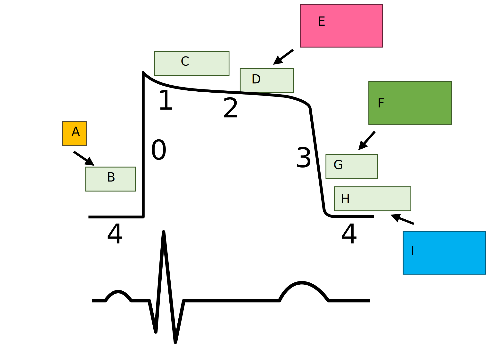

{}

## Basic Review

Before you get started on this section, take some notes and get everything you know down on paper.

1. Inotropy
   - Positive
      - 
____________

      - 
____________

      - 
____________

      - 
____________

      - 
____________

   - Negative
      - 
____________

      - 
____________

2. Chronotropy
    - Positive
      - 
____________

      - 
____________

      - 
____________

      - 
____________

    - Negative
      - 
____________

      - 
____________

      - 
____________

      - 
____________

3. Dromotropy
    - Positive
      - 
____________

    - Negative
      - 
____________

      - 
____________

      - 
____________

      - 
____________

      - 
____________

4. Lusitropy
    - Positive
      - 
____________

      - 
____________

      - 
____________

      - 
____________

    - Negative
      - 
____________

4. Bathomotropy
    - Positive
      - 
____________

      - 
____________

      - 
____________

      - 
____________

      - 
____________

    - Negative
      - 
____________

      - 
____________

Fill in the blanks before looking at the answer.

1. {}
The strengthening/weakening of cardiac contraction.
{}
Positive inotropes increase the strength of contraction.
{}
{}
Negative inotropes decrease the strength of contraction.
{}
{}
2. {}
Regulation of the heart rate.
{}
Positive chronotropes increase the heart rate.
{}
{}
Negative chronotropes decrease the heart rate.
{}
{}
3. {}
Action potential conduction speed through the AV node.
{}
Positive dromotropes increase the speed of conduction and shift the waveform to the left.
{}
{}
Negative dromotropes decrease the speed of conduction and shift the waveform to the right.
{}
{}
4. {}
Relaxation of the heart.
{}
Positive lusitropes increase relaxation of the heart.
{}
{}
Negative lusitropes decrease the relaxation of the heart.
{}
{}
5. {}
Excitability of the heart.
{}
Positive bathmotropes increase the excitability of the heart.
{}
{}
Negative bathmotropes decrease the excitability of the heart.
{}
{}

### ***What goes in each of the labeled sections below***

A

B

C

D

E

F

G

H

I

